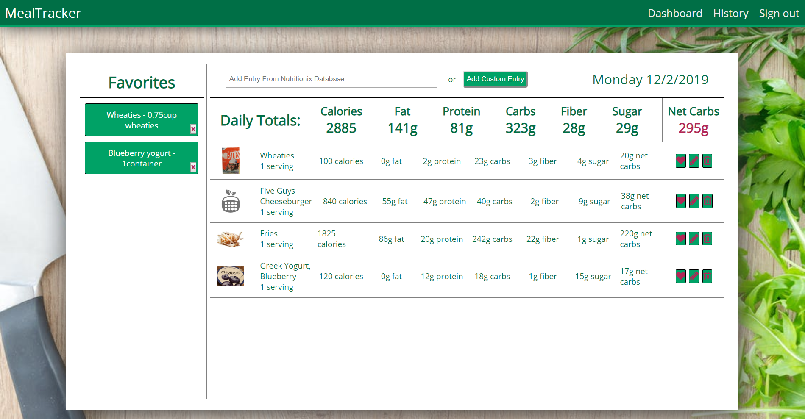

# Meal-Tracker-React

Meal-Tracker-React is a web application which allows the user to log in and track meals. Nutritional information can be entered manually, pulled from the Nutritionix API by means of a search bar and dropdown menu, or entered automatically from the Favorites list. The application will display daily calorie, fat, carbohydrate, fiber, sugar, protein, sodium, and net carb intake for users on a ketogenic diet. Historical daily totals are also available to view.

## Built With

MERN Stack: MongoDB, Express, React, Redux, Node, Passport, Google OAuth2, styled-components, Nutritionix API

## Getting Started

These instructions will get you a copy of the project up and running on your local machine for development and testing purposes.

### Server Prerequisites

- [Node.js](https://nodejs.org/en/)
- "body-parser": "^1.18.3",
- "cookie-session": "^2.0.0-beta.3",
- "express": "^4.16.4",
- "moment": "^2.24.0",
- "mongoose": "^5.4.8",
- "passport": "^0.4.0",
- "passport-google-oauth20": "^2.0.0",
- "request": "^2.88.0"

### Client Prerequisites

- "axios": "^0.18.0",
- "lodash": "^4.17.11",
- "materialize-css": "^1.0.0",
- "react": "^16.7.0",
- "react-dom": "^16.7.0",
- "react-redux": "^6.0.0",
- "react-router-dom": "^4.3.1",
- "react-scripts": "^2.1.5",
- "redux": "^4.0.1",
- "redux-form": "^8.1.0",
- "redux-thunk": "^2.3.0",
- "styled-components": "^4.1.3",
- "styled-react-modal": "^1.2.1"

### Installing

A Mongo database with three collections: meals, users, and favorites.

## Author

Chase Whitney
